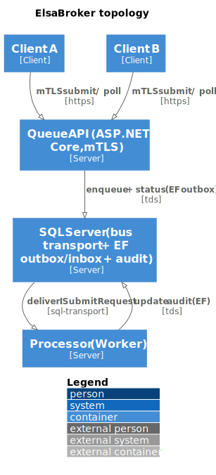

# Architecture

ElsaBroker is two services over one SQL Server database:

- **Queue API** (`ElsaBroker.Queue`) — ASP.NET Core. Terminates mTLS, validates the request against the
  registry, publishes via the EF outbox, and hosts the internal **callback listener** that finalizes a
  request when its workflow completes.
- **Processor** (`ElsaBroker.Processor`) — a Worker Service. Consumes messages and **dispatches each
  request type to its Elsa workflow** (async), then leaves the record `Processing` until the callback.

Both share **`ElsaBroker.Data`** (the `BrokerDbContext`, entities, and registries) and the
**`ElsaBroker.Contracts`** message envelope. SQL Server plays three roles at once: the **message
transport**, the **outbox/inbox** store, and the **audit** store. Request **processing** happens in a
separate **Elsa 3 server** — see [Elsa integration](elsa-integration.md).

## Topology

The diagram is generated from a NetJSON description by the sibling
[`netjson-diagrams`](https://ariugwu.com/netjson) tool and rendered offline — see
[diagram provenance](../diagrams/README.md).

### NetJSON source

[!code-json[broker.netjson](../diagrams/broker.netjson)]

## Request path

1. **Ingress.** Kestrel requires a client certificate. `MtlsAuthHandler` validates the CA chain, the
   validity window, and the allowlist thumbprint, then stamps `ClientId` from the certificate.
2. **Validation.** `RequestEndpoints` looks up `(ClientId, RequestType)` in the registry and checks the
   required keys are present. Unknown or unauthorized types are rejected before anything is enqueued.
3. **Enqueue (atomic).** The Queue writes a `RequestRecord` (`Queued`) and publishes `ISubmitRequest`
   **in the same transaction** via the EF outbox. The bus message and the audit row cannot diverge.
4. **Dispatch (async).** The Processor's `SubmitRequestConsumer` loads the record, sets it `Processing`,
   and resolves the `ElsaDispatchHandler` for the `RequestType` (auto-registered from the `workflows/`
   folder). The handler `POST`s the message to the Elsa **broker-dispatch** workflow and returns
   *deferred* — the record stays `Processing`.
5. **Run + callback.** Elsa runs the target workflow, then calls the broker's
   `POST /internal/requests/{id}/result` (internal listener `:5080`, shared secret), which sets the
   record `Completed` or `Faulted`.
6. **Poll.** The client polls `GET /requests/{correlationId}` (mTLS `:5001`) and only ever sees its own
   records.

## Why SQL Server for the transport

Using the MassTransit **SQL Server transport** means the queue, the outbox, and the audit trail live in
one database — one backup, one transaction boundary, one operational surface. There is no separate
broker (RabbitMQ/Azure Service Bus) to run, secure, and reason about. The trade-offs are recorded in
[ADR-0001](../adr/0001-use-masstransit-sql-server-transport.md) and
[ADR-0002](../adr/0002-transactional-outbox-inbox.md).

## Projects

| Project | Role |
|---------|------|
| `ElsaBroker.Contracts` | `ISubmitRequest` envelope + `RequestStatus` — stable, additive-only |
| `ElsaBroker.Data` | `BrokerDbContext`, entities, auth registry, **workflow-folder scanner/registry**, migrations |
| `ElsaBroker.Queue` | ASP.NET Core API — mTLS ingress `:5001`, validation, enqueue, poll, callback listener `:5080` |
| `ElsaBroker.Processor` | Worker — consume, **dispatch to Elsa** (async), per-type `ElsaDispatchHandler` |
| `ElsaBroker.CertTools` | CLI — CA + server/client certificate generation |
| `ElsaBroker.Tests` | xUnit — auth registry, workflow scanner, consumer (MassTransit harness + EF InMemory) |
| `workflows/` | shared Elsa workflow definitions (the dispatcher + one per request type) |

The runtime topology — broker, Elsa server, SQL Server, and the dispatch/callback hops — is in the
[Elsa + Broker deployment diagram](elsa-deployment.md).

Read on: [Elsa integration](elsa-integration.md), [messaging design](messaging-design.md), and the
[security model](security-model.md).
