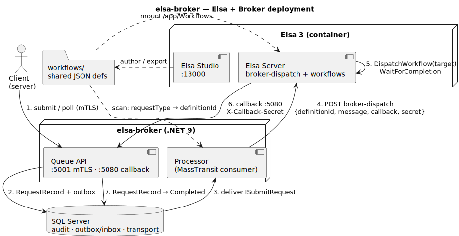

# Elsa + Broker deployment

How the pieces run together at runtime — the broker (Queue + Processor), the Elsa 3 server, SQL Server,
and the dispatch/callback hops. Rendered offline with PlantUML; regenerate via
`docs/scripts/render-diagram.sh`.

## Compose stack

The `docker compose up -d` command starts three containers:

| Service | Internal port | Exposed port | Role |
|---------|---------------|--------------|------|
| `sqlserver` | 1433 | `localhost:1433` | SQL Server — broker DB + MassTransit SQL transport |
| `elsa-server` | 8080 | `localhost:13002` | Custom **ElsaBroker.WorkflowServer** — auto-imports `workflows/` on startup |
| `elsa-studio` | 8080 | http://localhost:13000 | Elsa Studio UI — pointed at the custom server on 13002 |

The custom Elsa server (`elsa-server`) is a purpose-built image that omits MassTransit and enables the
file-based workflow importer (`WorkflowFolderImporter`). This is distinct from the official
`elsa-server-and-studio-v3` demo image. See [Elsa integration](elsa-integration.md) for why the custom
server is required.

## The flow

1. **Submit / poll** — the client calls the Queue API over mTLS on `:5001`.
2. **Enqueue** — the Queue writes a `RequestRecord` and publishes the message via the EF outbox (one
   transaction) into the SQL transport.
3. **Deliver** — the Processor consumes the message from the SQL transport.
4. **Dispatch** — the Processor `POST`s `{ definitionId, correlationId, message, callbackUrl, secret }`
   to the Elsa **broker-dispatch** workflow and returns *deferred* (record stays `Processing`).
5. **Run** — `broker-dispatch` runs the target workflow by id (`DispatchWorkflow`, `WaitForCompletion`).
6. **Callback** — Elsa `SendHttpRequest`s the outcome to the Queue's internal listener `:5080` with the
   shared `X-Callback-Secret`.
7. **Finalize** — the Queue sets the `RequestRecord` to `Completed`/`Faulted`; the client's next poll
   sees it.

The shared **`workflows/`** folder feeds both sides: the custom Elsa server imports it at `/app/Workflows`
on startup, and the Processor scans it to map `requestType → definitionId`. Elsa **Studio** (`:13000`) is
where you author and export those workflows.

See [Elsa integration](elsa-integration.md) for the convention and the async-callback rationale.
