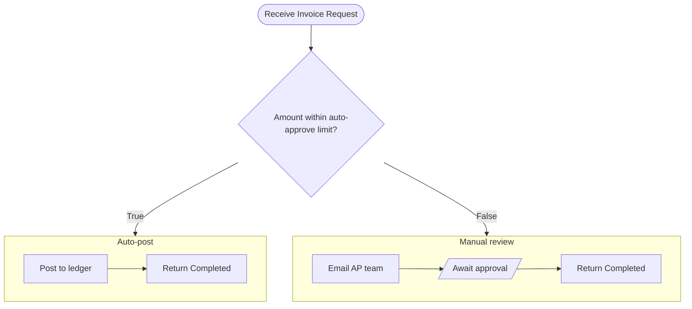

```mermaid
flowchart TD

    HttpEndpoint1(["Receive Invoice Request"])
    If1{"Amount within auto-approve limit?"}
    subgraph Sequence1["Auto-post"]
        SendHttpRequest1["Post to ledger"]
        WriteHttpResponse1["Return Completed"]
        SendHttpRequest1 --> WriteHttpResponse1
    end
    subgraph Sequence2["Manual review"]
        SendEmail1["Email AP team"]
        Signal1[/"Await approval"/]
        WriteHttpResponse2["Return Completed"]
        SendEmail1 --> Signal1
        Signal1 --> WriteHttpResponse2
    end

    HttpEndpoint1 --> If1
    If1 -->|True| Sequence1
    If1 -->|False| Sequence2
```
